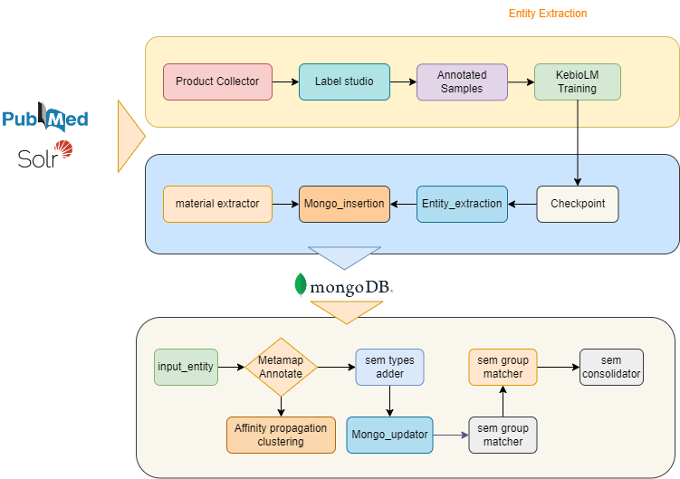
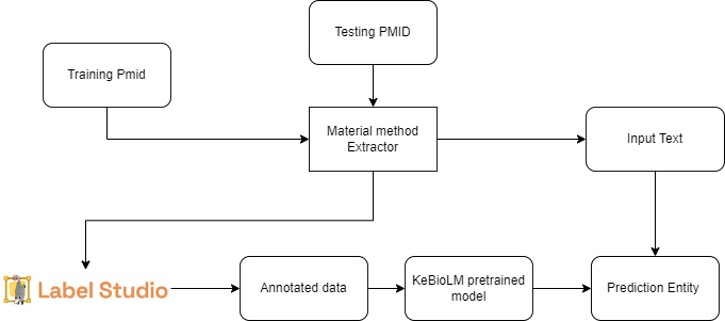
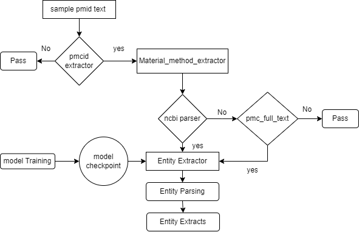

# Product Extraction and Product Consolidation

## Scibert Model
1. 1.14M papers from Semantic  Scholar (Ammar et al., 2018). 
2. This corpus consists of 18% papers from the computer science domain and 82% from the broad biomedical domain
3. The average paper length is 154 sentences (2,769 tokens) resulting in a corpus size of 3.17B tokens, 
   similar to the 3.3B tokens  on which BERT was trained.

4. 4 models 
   (i)   cased or uncased  
   (ii)  BASEVOCAB or SCIVOCAB.
   (iii) The two models that use BASEVOCAB are finetuned from the corresponding BERT-Base models. The
         other two models that use the new SCIVOCAB are trained from scratch

5. Finetuning 
   1. Text classification: [CLS] --> Linear classification layer
   2. NER: token --> Linear classification layer --> softmax output --> conditional random field 
   3. DEP: Dependency tag - arc embedding(size 100) - biaffine matrix --> Bert vectorizer 
   4. Dropout : 0.1 
   5. Loss and Optimizer: Cross Entropy and Adam
   6. Epoch, Batch and learning rate: 2-5, 32 and 5e-6, 1e-5, 2e-5,5e-5
   7. Final set : 2-4 epochs, 2e-5 learning rate 

## KeBioLM: Knowledge enhanced Biomedical pretrained Language Model
### Paper 
https://arxiv.org/pdf/2104.10344.pdf****

### Repo cloned and configured
https://github.com/GanjinZero/KeBioLM

### Download the pretrain weights
https://drive.google.com/file/d/1kMbTsc9rPpBc-6ezEHjMbQLljW3SUWG9/edit
from google_drive_downloader import GoogleDriveDownloader as gdd
gdd.download_file_from_google_drive(file_id='1kMbTsc9rPpBc-6ezEHjMbQLljW3SUWG9',dest_path='/data2/skumar20/Product_prediction/pretrained/KeBioLM.zip',unzip=True)

## Testing the model prediction

###  Extraction and prediction with real time data

#### Discussed Flow diagram

#### Keypoints
1. material methods will be used to extract material method chunks for training data 
2. Then we will use material methods chunks to label studio
3. We will train the KeBiolm model and sample material method chunk will be feed for predictions

#### Implemented Workflow
We will test model accuracy for sample pmid and will predict the entity for material methods data.

