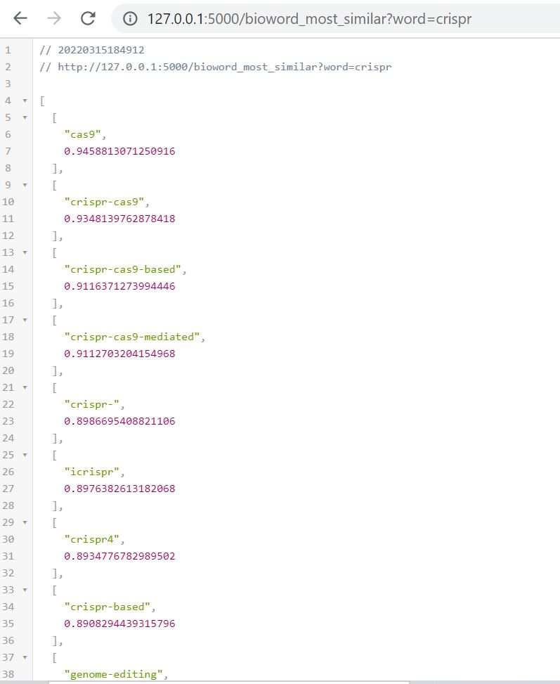
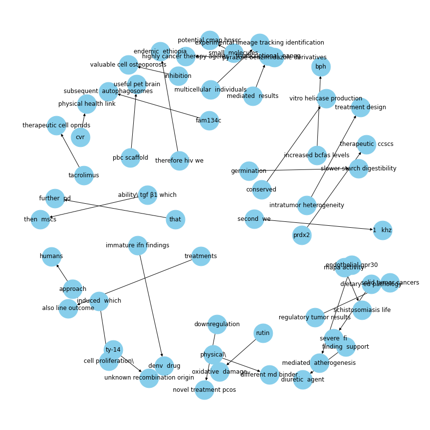
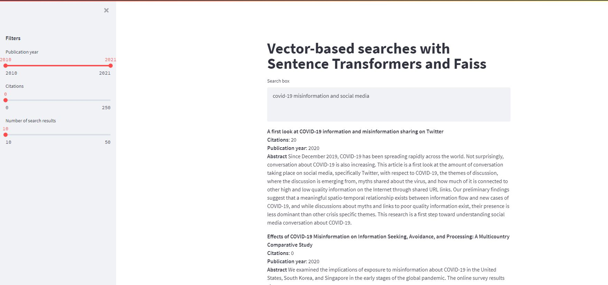

# BioNLP

## Keyphrase Extractions

Here is some interesting stuff that I want to talk about.  But first, let's review.
Insert [Abstract_tfidf_doc.html](Abstract_tfidf_doc.html)
path [here](https://htmlpreview.github.io/?) 

* Fasttext Word2vec and Bioword vec Embedding for word similarity check

#### Fasttext
To get Fastext Word embedding run fasttext_model.py from Fasttext directory 
Uncomment last and will store word embedding in word_embedding folder

    1. word2vec5k.bin
    2. word2vec5k.bin.wv.vectors_ngrams.npy

#### Biowordvec Embedding
To download Biowordvec embedding click 
[here](https://figshare.com/articles/dataset/Improving_Biomedical_Word_Embeddings_with_Subword_Information_and_MeSH_Ontology/6882647)

#### Flask Api for word similarity 
1. Run word_vec_app.py 
   Will display
   * Running on http://127.0.0.1:5000/ (Press CTRL+C to quit)

2. open Browser and insert
    word2vec
    http://127.0.0.1:5000/most_similar?word=crispr

    Bioword2vec
    http://127.0.0.1:5000/bioword_most_similar?word=crispr

### Fasttext 

### Bioword 

## Keyphrase Extraction roadmap and skeleton
To check keyword extraction extraction pipeline
First download Bioword2vec pretrained embedding from [here](https://figshare.com/articles/dataset/Improving_Biomedical_Word_Embeddings_with_Subword_Information_and_MeSH_Ontology/6882647)
and put inside word_embedding directory and run main.py

* Below is workflow in nutshell to get insights 
1. Candidate Keywords selection and Extraction
   i.  Bioword2vec  
   ii. Scispacy
   
2. Sentence Transformers
   i.  Scibert(scibert-nli)
   ii. DistilBERT(Fast execution)

3. Redundant and duplicate Keyphrase elimination
   i. Maximal Marginal Retrieval
   
Further Improvements
1. Streamlit app for term searched pubmed full text article extraction and extract Keyphrase
2. Fastapi for serving as service for Keyphrase Extractions
3. Create Generalize NER model using Biomedical Corpora given [here](https://github.com/BaderLab/Biomedical-Corpora)

##Biomedical Product Extraction and Consolidation
In progress will just provide skeleton 

### Biomedical symtoms audio and text classification
https://www.kaggle.com/paultimothymooney/medical-symptoms-text-and-audio-classification/notebook
Roadmap 

## Name Entity Recognition 
https://metatext.io/datasets-list/ner-task

## Entity Linking (EL)
https://medium.com/nerd-for-tech/building-bi-encoder-based-entity-linking-system-with-transformer-6c111d86500
https://github.com/izuna385/Entity-Linking-Recent-Trends

## Semantic search engine using Transformers and Faiss

https://towardsdatascience.com/how-to-build-a-semantic-search-engine-with-transformers-and-faiss-dcbea307a0e8
https://towardsdatascience.com/how-to-deploy-a-semantic-search-engine-with-streamlit-and-docker-on-aws-elastic-beanstalk-42ddce0422f3

https://www.kaggle.com/narasimha1997/faster-semantic-search-using-faiss

## Pubtator
https://www.ncbi.nlm.nih.gov/research/pubtator/
https://nlp.johnsnowlabs.com/api/python/user_guide/training.html
